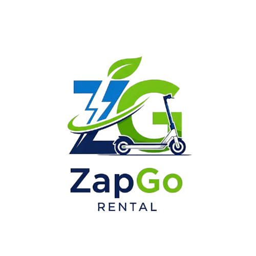

<p align="center">
	
</p>

# 🚀 ZapGo – Electric Scooter Rental Platform

Welcome to **ZapGo**, the next-generation electric scooter rental platform designed for seamless, secure, and smart urban mobility.

---

## 🌟 Features

- **Modern Landing Page**: Engaging, mobile-first design with dynamic pricing, FAQs, and contact info.
- **Booking Wizard**: Step-by-step flow for selecting dates, vehicles, plans, and entering rider details.
- **Real-Time Availability**: Calendar view to check and book available scooters instantly.
- **Booking Status & Tracker**: Public status page with QR code, plus tracker for quick access using phone/code.
- **Admin Dashboard**: Manage vehicles, plans, riders, and bookings with analytics and charts.
- **KYC & Secure Payments**: Integrated document upload, KYC checks, and payment gateway support.
- **PWA Support**: Installable as a Progressive Web App for a native-like experience.
- **SEO & Performance**: Optimized for Core Web Vitals, accessibility, and search engine ranking.
- **24/7 Support**: Built-in contact and support modules for instant help.

---

## 🛠️ Tech Stack

- **Framework:** Next.js 14 (App Router, TypeScript)
- **Styling:** Tailwind CSS, custom themes
- **State Management:** React Context, hooks
- **Validation:** Zod schemas
- **Database/API:** (Pluggable, e.g., MSSQL, RESTful APIs)
- **Auth:** Secure authentication & role-based access
- **CI/CD:** Ready for Vercel/Netlify deployment

---

## 🚦 Quick Start

```bash
# 1. Install dependencies
npm install

# 2. Run the development server
npm run dev

# 3. Open http://localhost:3000 in your browser
```

---

## 🎨 Design System

- **Primary Color:** #007BFF (Blue – trust & reliability)
- **Accent Color:** #32CD32 (Lime Green – highlights & CTAs)
- **Background:** #F8FAFC (Light Gray – clean, modern)
- **Fonts:**
	- Headings: Poppins
	- Body: Inter
	- Codes/IDs: Roboto Mono
- **UI:** Mobile-first, rounded cards, sticky bottom bar CTA, subtle shadows

---

## 📦 Folder Structure

```text
src/
	app/           # Next.js app routes (landing, admin, api, etc.)
	components/    # Reusable UI and feature components
	lib/           # Utilities, constants, schemas
	public/        # Static assets (images, icons, manifest)
```

---

## 🤝 Contributing

Pull requests are welcome! For major changes, please open an issue first to discuss what you would like to change.

---

## 📄 License

This project is licensed under the MIT License.